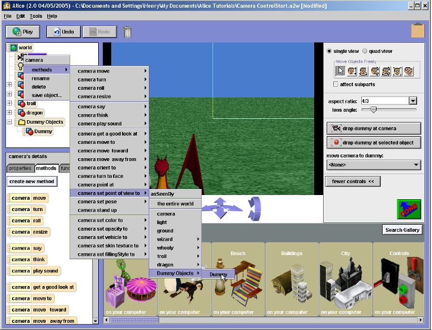

Herramientas de desarrollo de software desde el punto de vista educativo.
=========================================================================

!

Descripción de proyectos reales.
================================

!

Lenguajes para el aprendizaje
------------------------------------

!

Python
------

!

* Lenguaje de alto nivel, es decir, más cercano al lenguaje natural
* Sintaxis sencilla y uniforme
* Desarrollo interactivo
* Diversos paradigmas de programación: procedural, funcional y orientado a objetos

!

Para desarrollar en Android...

* [Kivy](http://kivy.org)

!

Scheme
------
* Desarrollado con fines educativos en el MIT.
* En lugar de centrarse en la sintaxis, tenía como objetivo estudiar directamente ideas fundamentales de la programación.
* Introdujo una característica técnica: las llamadas ultraligeras a funciones. Pedagógicamente, esto permitió enseñar programación en términos de lenguajes especializados (lenguajes para calcular, lenguajes para dibujar, lenguajes para razonar...).

!

Para desarrollar en Android...

* [SchemeSpheres](http://schemespheres.org/)
* [Kawa](https://www.gnu.org/software/kawa/)

!

Java
----
* Buena base para otros lenguajes orientados a objetos, muy empleados en la industria (C++, Ruby, Python...)
* Buena aproximación al paradigma de orientación a objetos
* Muy popular en entornos profesionales, es el lenguaje elegido para el API de Android
* Muchas librerías y entornos para facilitar el aprendizaje

!

Para desarrollar en Android...

* [Processing](http://processing.org)
* En la práctica, cualquier herramienta que emplee el [Kit de Desarrollo de Android (SDK)](https://developer.android.com/sdk)

!

Otros lenguajes
---------------

!

_BASIC_, inventado en 1964 para facilitar el acceso a la computación a estudiantes. En esta época, la relación con un ordenador implicaba mucha más programación para un usuario común.

!

_Logo_ es un lenguaje específicamente diseñado para introducir a los niños en la programación. En implementaciones más modernas, un elemento de dibujado, conocido como _la tortuga_, hace que la programación sea más atractiva para los niños mediante el control de una tortuga que dibuja en la pantalla con su rastro.

!

_Pascal_ es uno de los lenguajes más conocidos desarrollado con la educación en mente. Fue muy empleado durante los '80 como lenguaje de introducción a la programación.

!

Las "otras" alternativas... _Haskell_, _Qi_, _Oz_, _Smalltalk/Squeak_.

!

Pero desarrollar Apps para __Android__ en estos lenguajes no es tan sencillo... (aunque siempre hay una manera)

!

Entornos de desarrollo para el aprendizaje
==========================================

!

Programación Visual, por bloques
--------------------------------

!

* [Android App Inventor](http://appinventor.mit.edu/)
* [DesignBlocks](http://www.designblocks.net/)
* [Etoys](http://www.squeakland.org/)
* [StarLogo](http://education.mit.edu/starlogo/)
* [Stencyl](http://www.stencyl.com/)
* [Scratch](http://scratch.mit.edu/)

!

App Inventor
------------

!

Designblocks
------------

!

Starlogo
--------

!

Stencyl
-------

!

Scratch
-------

!

Positivo
--------
* __App Inventor__ y __Stencyl__ se pueden emplear para desarrollar Apps de __Android__
* Generalmente estos programas suelen tener muchos tutoriales para principantes
* Es programación puramente drag-and-drop, intuitiva e inmediata, facilitando así el aprendizaje por prueba y error

!

Negativo
--------
* No enseñan a programar con código textual
* No enseñan funciones ni diversas abstracciones, simplemente estructuras básicas de control

!

Programación visual, basada en entornos 3d
------------------------------------------

!

* [Alice / Mama](http://alice.org)
* [Agentcubes](http://www.agentsheets.com/agentcubes/index.html)
* [Kodu](http://research.microsoft.com/en-us/projects/kodu/)
* Lightbot

!

Alice
-----

!

Agentcubes
----------
<iframe width="560" height="315" src="http://www.youtube.com/embed/2GWcb3aG2w0" frameborder="0" allowfullscreen></iframe>

!

Kodu
----
<iframe width="560" height="315" src="http://www.youtube.com/embed/M6UCVk8Lpy0" frameborder="0" allowfullscreen></iframe>

!

Lightbot
--------

!

Positivo
--------

* Son similares a los entornos de programación por bloques, pero suelen tener más posibilidades y mayor similitud a los lenguajes de programación.
* El caso de la metodología de Kodu es único, con un paradigma ligeramente diferente basado en eventos.
* Son un buen segundo paso tras las herramientas de programación visual por bloques

!

Negativo
--------

* Introducen mayor complejidad no necesariamente vinculada con el aprendizaje de la programación por la introducción de entornos 3d.
* Suelen tener menor número de tutoriales, ya que su uso está menos extendido.
* Las mismas desventajas que la programación visual por bloques

!

Entornos de programación que asisten en el aprendizaje
------------------------------------------------------

!

* Hackety Hack!
* Kid's Ruby
* Greenfoot
* BlueJ
* DrRacket

!

Hackety Hack!, Kids Ruby
------------------------

!

Greenfoot, BlueJ, DrRacket
--------------------------

!

Positivo
--------
* Aprendizaje de programación basada en texto
* Orientados al aprendizaje de lenguajes de programación empleados en la industria (Java, Scheme), facilitando el acceso a éstos.
* Hay juegos y aplicaciones de buena calidad realizados con estas herramientas.

!

Negativo
--------
* Se encuentran en un punto medio de la curva de aprendizaje, con lo que su acceso no es tan sencillo como en los casos anteriores.
* Por ese motivo, no son muy populares.
* En general, no facilitan el desarrollo en plataformas móviles como Android.

!

Aprendizaje On-line
-------------------

!

* [CodeAcademy](http://www.codecademy.com/)
* [Codeschool](http://www.codeschool.com/)
* [Udacity](https://www.udacity.com/)

!

Udacity
-------

!

Positivo
--------
* Muy fácil empezar. No requiere instalación y el proceso completo suele ser guiado.
* Aprender herramientas y lenguajes 100% profesionales

!

Negativo
--------
* Orientado al mercado profesional, no especialmente indicado para _aprender a programar_.

!

Entornos de desarrollo para programación de gráficos e interacción
------------------------------------------------------------------

* [Processing](http://processing.org)
* [Open Frameworks](http://www.openframeworks.cc/)
* [GameMaker](http://www.yoyogames.com/gamemaker)
* [SchemeSpheres](http://schemespheres.org)

!

Processing
----------

!

GameMaker
---------

!

SchemeSpheres
-------------

!

Positivo
--------
* Todos estos proyectos permiten el desarrollo de Apps gráficas para Android
* Aprendizaje de lenguajes y técnicas profesionales
* Rápido feedback visual, con la motivación que esto implica
* Puerta de entrada para la construcción de software a nivel profesional

!

Negativo
--------
* Principalmente orientado a gráficos e interactividad, con lo que ciertos aspectos necesarios en la formación pueden quedarse atrás a cambio de un resultado más _visual_.

!

U-tad
=====

!

Algunas de las experiencias con la enseñanza de programación en U-tad
---------------------------------------------------------------------
* Processing: DVCD
* GameMaker: DPIN, DVCD
* SchemeSpheres: IDCD
* ...

!

Colaboración _Ingeniería_ y _Diseño Visual_
===========================================
Software: SchemeSpheres
-----------------------

!

RabbitRage
----------
(DVCD: Nalúa y Francisco; IDCD: Pablo)
<iframe width="560" height="315" src="http://www.youtube.com/embed/MzuXjokNh0o" frameborder="0" allowfullscreen></iframe>

!

PinkFace
--------
(DVCD: Ángel, Carlos y Marcos Y.; IDCD: Rodrigo)
<iframe width="420" height="315" src="http://www.youtube.com/embed/2A6lM8dKgiM" frameborder="0" allowfullscreen></iframe>

!

Colorsurvive
------------
(DVCD: Remedios, Elena y Andrea; IDCD: Daniel)
<iframe width="560" height="315" src="http://www.youtube.com/embed/mm0bWNG-fLE" frameborder="0" allowfullscreen></iframe>

!

Ratón a la Carrera
------------------
(DVCD: Beatriz Lorenzo y Juan; IDCD: Guillermo)
<iframe width="560" height="315" src="http://www.youtube.com/embed/QyjEsv_DPoc" frameborder="0" allowfullscreen></iframe>

!

Conclusiones sobre la experiencia
--------------------------------

* El trabajo en equipo con alumnos de distinta formación y sin experiencia es un __trabajo añadido__ para los alumnos, lejos de simplificarles el trabajo
* No siempre les resulta fácil __comunicarse__, en ambas direcciones
* Refleja una situación real de la __profesión__, así como una problemática habitual

!

¡Muy contentos con el trabajo de los alumnos!
=============================================

!

Gracias
=======

